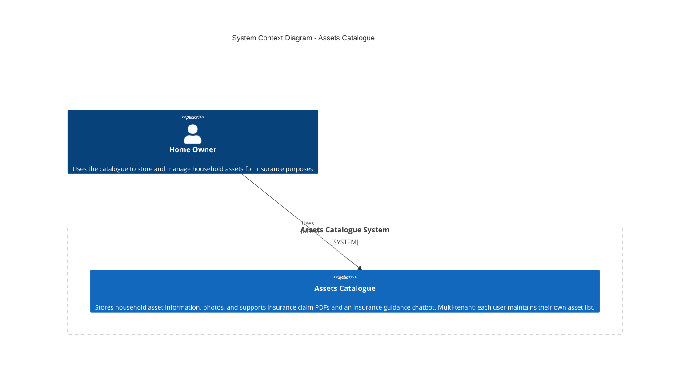

# C4 Level 1 – System Context Diagram

## Diagram

## Explanation

- **Home Owner**: The only primary user; they use the system to catalogue household assets (with up to 4 photos per asset), assign categories and values, generate insurance claim PDFs, and use the insurance chatbot. Access is authenticated (e.g. via Azure Entra ID).
- **Assets Catalogue**: The software system in scope. There are no external systems; the system is self-contained for identity (Entra ID), storage (Cosmos DB, Blob), compute (Functions, Static Web Apps), and optional AI (Azure AI Foundry / OpenAI).
- **Relationship**: The home owner uses the system over HTTPS. All API access is restricted to authenticated users.
