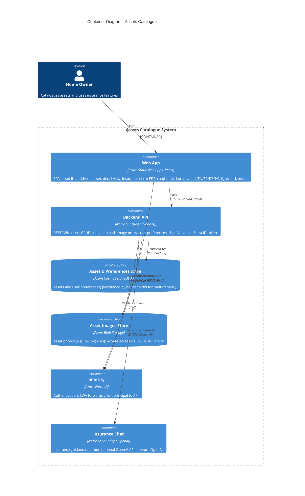

# C4 Level 2 – Container Diagram

## Diagram

## Explanation

- **Web App (Static Web Apps)**: Single-page React app. Provides asset list, add/edit, detail view, insurance claim PDF generation, and chatbot UI. Handles locale and theme; all API calls go through SWA proxy with authentication.
- **Backend API (Azure Functions)**: Node.js v4 model. Handles assets CRUD, image upload, image proxy (for CORS/PDF), user preferences, and chat. Authenticates requests using the identity provided by SWA (Entra ID).
- **Cosmos DB**: Persists assets and user preferences. Partition key `householdId` enforces multi-tenancy.
- **Blob Storage**: Stores asset images (e.g. up to 4 per asset); access is private (SAS or via proxy).
- **Identity (Entra ID)**: All user access is authenticated; no anonymous API access.
- **Insurance Chat**: Implemented via Azure AI Foundry or OpenAI; the API forwards user messages and optional context (e.g. asset summary) and returns assistant replies.

Technology choices are Azure-native and align with the prescribed stack: Entra ID, Functions, Cosmos DB, Application Insights (observability, implied), Azure AI Foundry, Storage, Static Web Apps.
