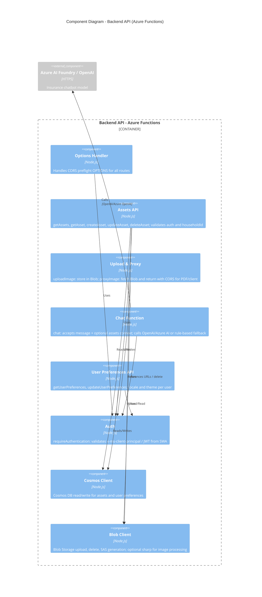

# C4 Level 3 – Component Diagram (Backend API)

## Diagram

## Explanation

- **Options Handler**: Responds to OPTIONS for CORS; typically registered first so preflight succeeds for all routes.
- **Assets API**: Implements CRUD for assets. Uses Auth for identity and householdId; persists data via Cosmos Client; coordinates with Blob for image URLs and delete.
- **Upload & Proxy**: Upload stores files in Blob (with optional resizing); proxy fetches from Blob and returns the response with CORS headers so the client (e.g. PDF generator) can load images without tainting.
- **Chat Function**: Authenticated; takes user message and optional asset context; calls Azure AI Foundry / OpenAI for replies or falls back to rule-based responses.
- **User Preferences API**: Get/update user preferences (e.g. language, dark mode) stored in Cosmos, keyed by user/household.
- **Auth**: Shared middleware that requires a valid client principal (from Static Web Apps) or JWT; used by all business functions.
- **Cosmos Client / Blob Client**: Shared data access; Blob Client may use sharp for image processing (e.g. thumbnails) where applicable.

The diagram shows the API as the container and its major components; the external AI service is shown as `Container_Ext` to keep the diagram within the C4 component scope of the backend.
