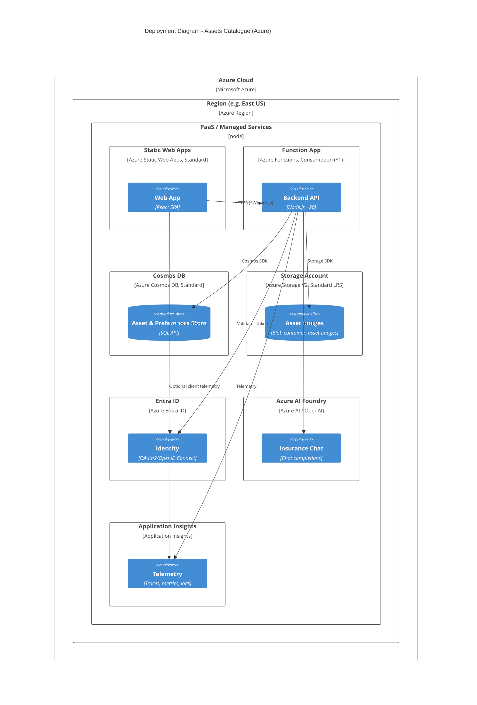

# C4 Level 4 – Deployment Diagram

## Diagram

## Explanation

- **Region**: All resources are deployed in a single Azure region (e.g. resource group location) to meet 99.9% availability with standard PaaS SLAs; no custom VNets or subnets are assumed.
- **Static Web Apps**: Hosts the React SPA; Standard tier. Serves UI and proxies API requests to the Function App with the client principal header.
- **Function App**: Consumption plan (Y1), Node.js ~20, v4 programming model. Scales with demand; connects to Cosmos, Storage, and (optionally) Azure OpenAI via app settings.
- **Cosmos DB**: SQL API; database and container (e.g. assets, partition key householdId). Session consistency; single region as per assumptions.
- **Storage Account**: Standard LRS; one blob container for asset images. Private access; Functions use connection string or managed identity.
- **Entra ID**: Tenant-based authentication; SWA integrates with Entra for sign-in and forwards the principal to the API.
- **Azure AI Foundry**: Shown as the Azure-native option for the insurance chatbot (e.g. Azure OpenAI). Can be in the same or linked subscription.
- **Application Insights**: Linked to the Function App (and optionally SWA) for traces, metrics, and logs; supports 99.9% operational visibility.

PaaS/SaaS boundaries: Static Web Apps, Functions, Cosmos DB, Storage, Entra ID, AI Foundry, and Application Insights are all managed services; no explicit scaling units or subnet layout are shown, in line with “no scalability needs” and production-ready single-region Azure deployment.
