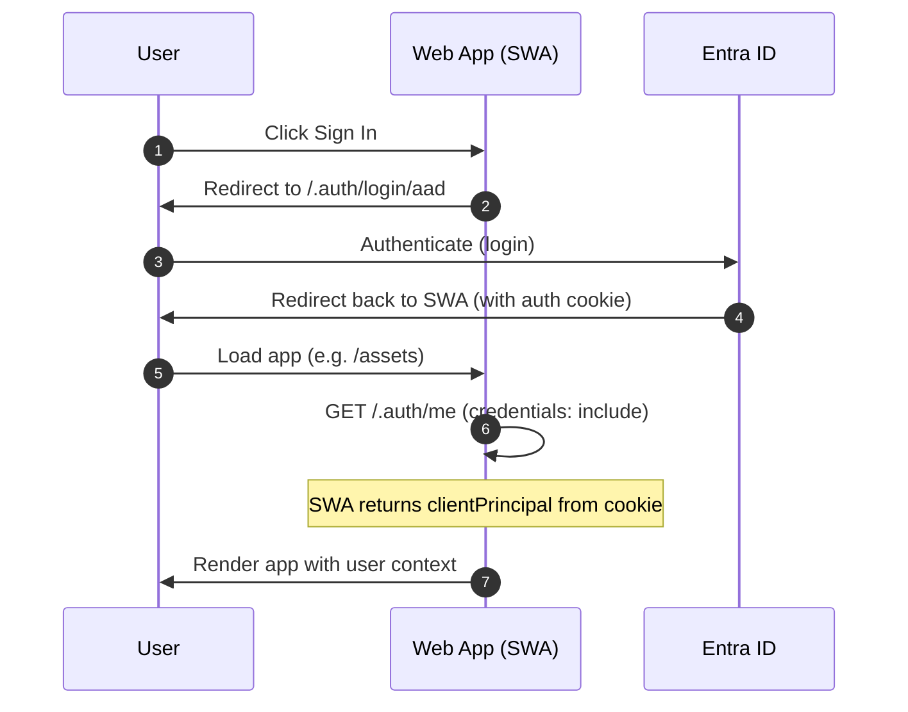
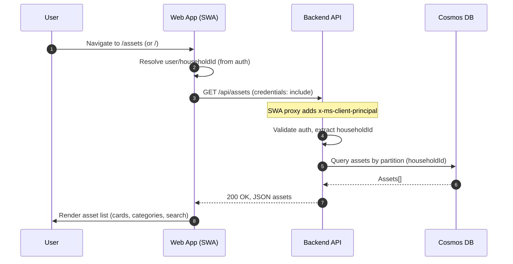
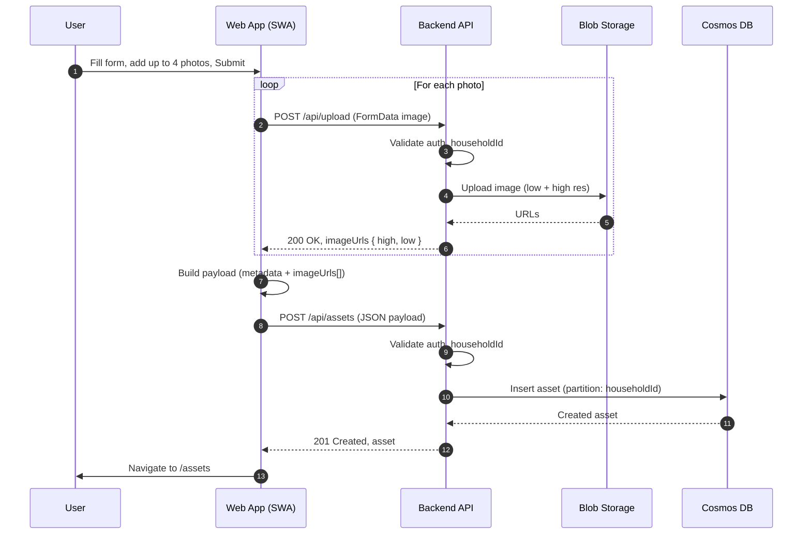
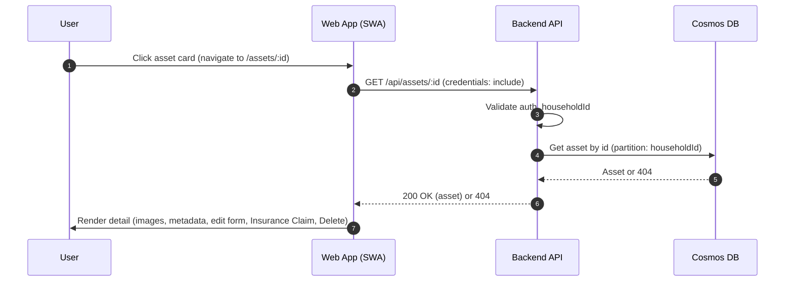
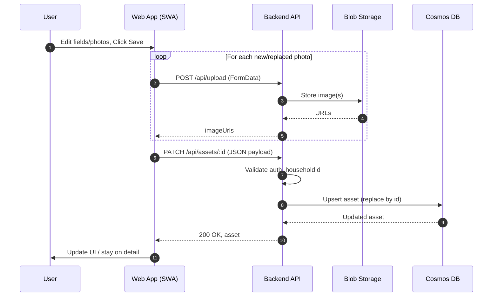
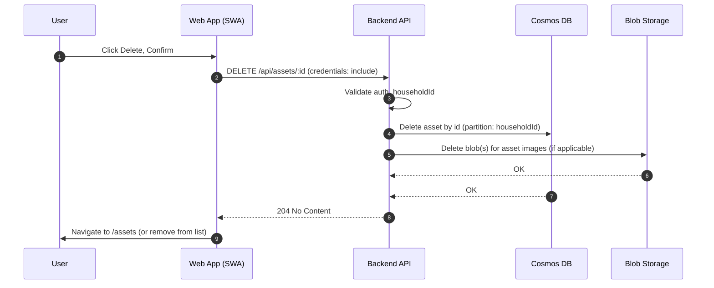
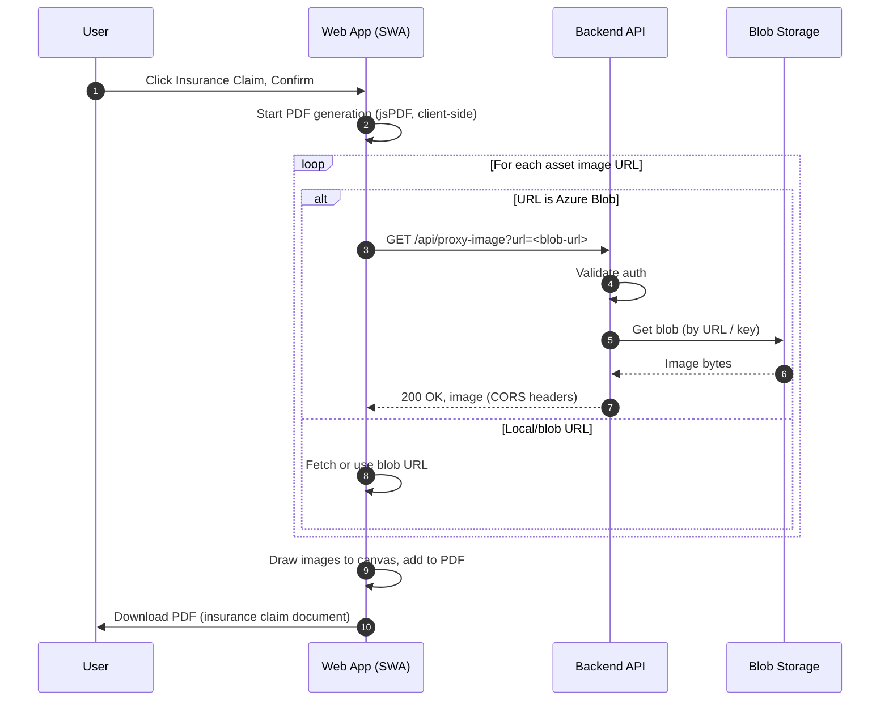
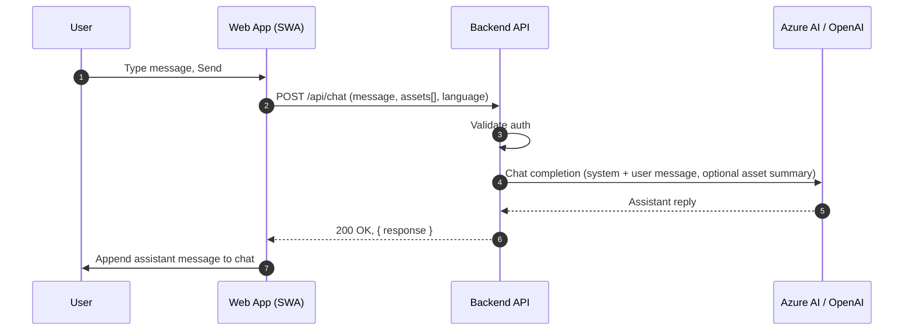
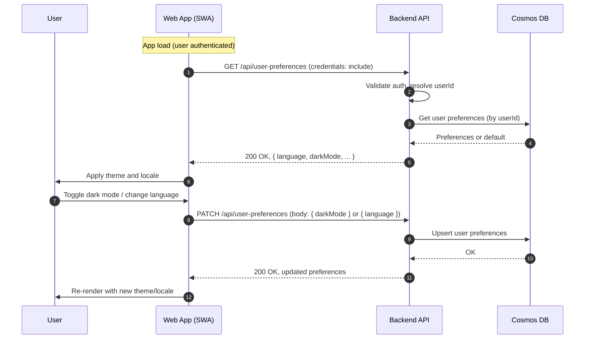

# Sequence Diagrams – User Interactions

This document contains Mermaid sequence diagrams for each major user interaction in the **Assets Catalogue** application. Participants are the main components: **User** (browser), **Web App** (Static Web App / React), **API** (Azure Functions), **Cosmos DB**, **Blob Storage**, **Entra ID**, and **AI** (Azure AI Foundry / OpenAI) where relevant.

---

## 1. Sign in (Authentication)

User initiates sign-in; SWA redirects to Entra ID and, after login, redirects back. The app then checks auth via `/.auth/me`.

---

## 2. Load asset list

User opens the assets page; the app fetches the list for the current household and optionally applies client-side search/filter.

---

## 3. Add new asset (with photos)

User fills the add-asset form and submits. The app uploads each photo first, then creates the asset with the returned image URLs.

---

## 4. View asset detail

User opens a single asset to view (and optionally edit) its details.

---

## 5. Edit asset

User updates asset details and/or photos on the detail page and saves.

---

## 6. Delete asset

User deletes an asset from the detail page (or list). API removes the asset document and optionally blob data.

---

## 7. Generate insurance claim PDF

User triggers “Insurance Claim” on the asset detail page. The app generates the PDF in the browser; for Azure Blob image URLs it uses the proxy to avoid CORS/tainted canvas.

---

## 8. Insurance chatbot (send message)

User types a message in the chatbot; the app sends it (with optional asset context and language) to the API, which calls AI and returns the reply.

---

## 9. Load and update user preferences (language, dark mode)

On load, the app fetches user preferences; when the user changes language or dark mode, it updates preferences via the API.

---

## Summary of interactions

| # | Interaction            | Main components involved                                      |
|---|------------------------|---------------------------------------------------------------|
| 1 | Sign in                | User, Web App, Entra ID                                       |
| 2 | Load asset list        | User, Web App, API, Cosmos DB                                |
| 3 | Add new asset          | User, Web App, API, Blob Storage, Cosmos DB                  |
| 4 | View asset detail      | User, Web App, API, Cosmos DB                                |
| 5 | Edit asset             | User, Web App, API, Blob Storage, Cosmos DB                  |
| 6 | Delete asset           | User, Web App, API, Cosmos DB, Blob Storage                  |
| 7 | Generate claim PDF     | User, Web App, API (proxy-image), Blob Storage              |
| 8 | Chat (insurance)       | User, Web App, API, Azure AI / OpenAI                        |
| 9 | User preferences       | User, Web App, API, Cosmos DB                                |

All API calls from the Web App go through the Static Web Apps proxy when deployed, which forwards the authenticated client principal to the Backend API.
